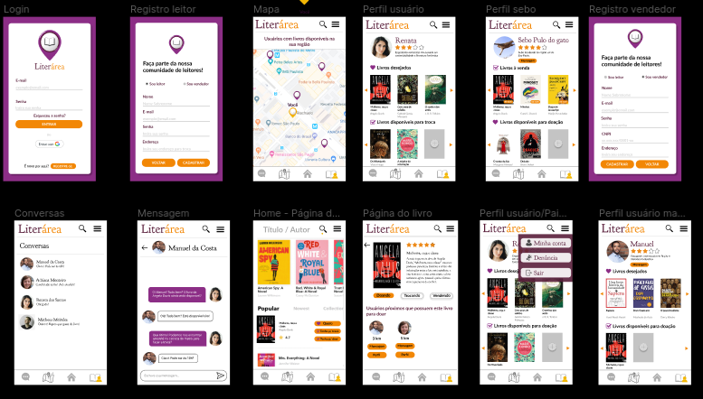

# Literárea

## Índice

* [1. Introdução](#1-introdução)
* [2. Protótipo](#3-protótipo)
* [3. Ferramentas utilizadas](#4-ferramentas-utilizadas)
* [4. Como utilizar](#4-como-utilizar)

***

## 1. Introdução

O projeto Literária foi desenvolvido durante o *bootcamp* da Laboratória. Organizadas em *squad*, planejamos durante uma semana (*design sprint*) o aplicativo, identificando e validando o problema dores do usuário, realizando o *benchmark* para conhecer soluções de concorrentes, desenhando o protótipo e realizando testes de usuário.
Após toda a etapa de planejamento, desenvolvemos o MVP do aplicativo em dois dias para apresentá-lo no Open House (evento em que algumas empresas avaliaram os projetos desenvolvidos pela turma).

A proposta era criar um produto relacionado a entretenimento. Decidimos criar um aplicativo que facilitasse a troca e doações de livros, considerando essa uma forma de incentivar e democratizar o acesso à leitura como forma de entretenimento.

Literárea é um produto que permite adquirir livros a baixo custo ou custo zero. Nele é possível criar suas próprias coleções de livros (desejados e disponíveis para doação e troca), encontrar outros usuários por geolocalização, visualizar suas coleções e entrar em contato para marcar um ponto de encontro e realizar a troca/doação.

## 2. Protótipo

A interface foi prototipada no [Figma](https://www.figma.com/):

## 3. Ferramentas utilizadas

O projeto foi desenvolvido em Javascript, HTML5 e CSS3. Utilizamos as APIs [Firebase](https://firebase.google.com/), [Google Books](https://developers.google.com/books) e [Here](https://developer.here.com/).

## 4. Como utilizar

Ao entrar na aplicação, o usuário poderá se registrar ou fazer o login, caso já tenha uma conta cadastrada.

O usuário terá acesso à pagina inicial, onde pode encontrar outros usuários no mapa, a partir de sua localização. Ao clicar em um pin, aparecerão as informações das coleções do usuário selecionado. Nessa mesma página, também é possível fazer uma pesquisa de livros, pelo título ou autor, e assim, adicionar os livros de interesse às suas coleções.
